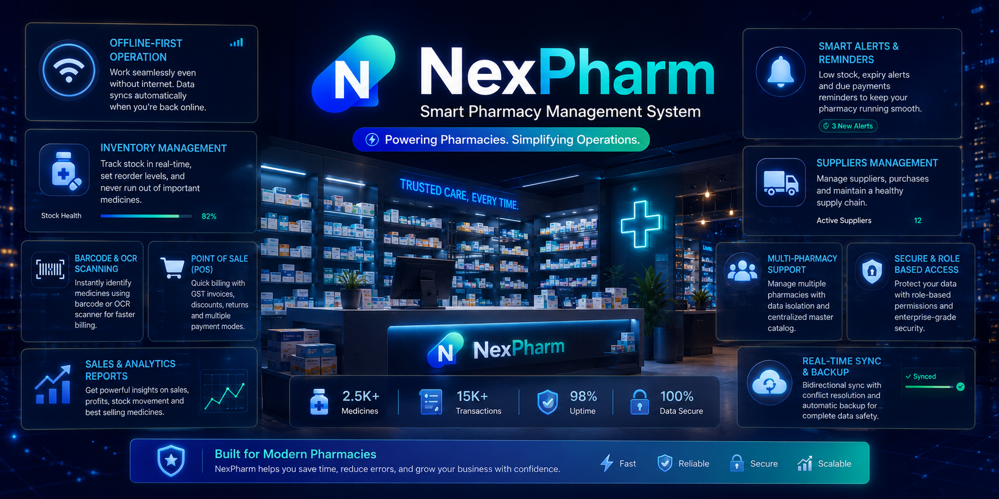
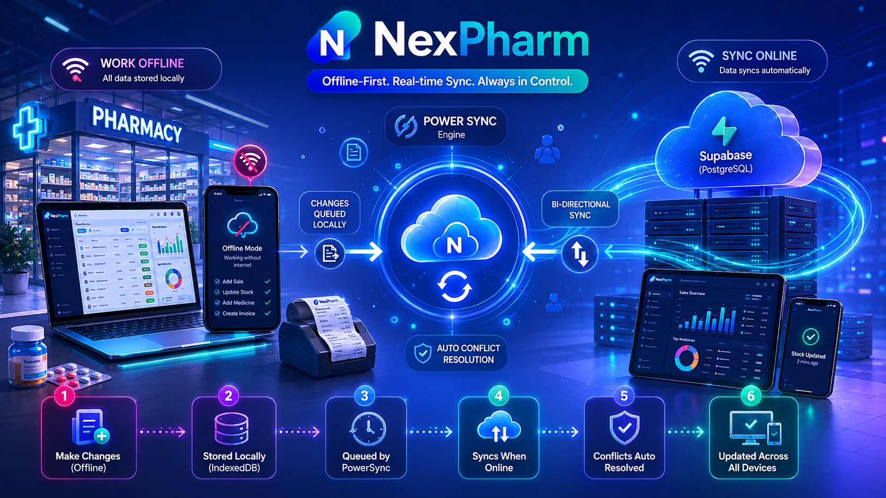
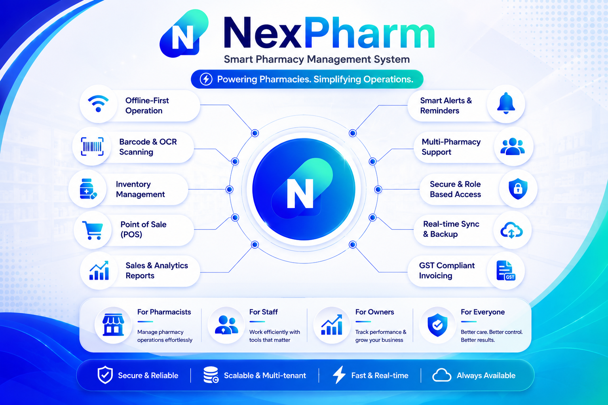
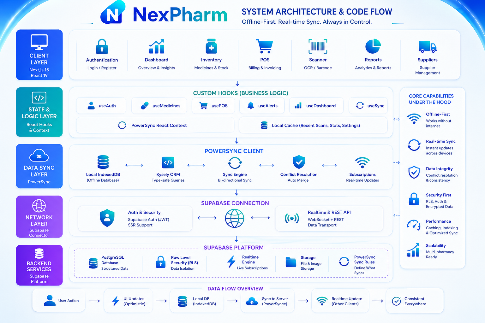

# 🏥 NexPharm

> A state-of-the-art, **offline-first pharmacy inventory and POS management system** designed for modern, high-volume pharmacy operations. 



---

## ✦ Vision

Pharmacy inventory should not fail when the internet does. NexPharm acts as a high-reliability local-first platform designed to solve real-world billing, expiry tracking, and medicine scanning challenges. Operating with a robust offline-first architecture, it provides pharmacy staff with uninterrupted operations, microsecond-latency POS billing, and real-time backend synchronization.

---

## ✦ Tech Stack

| Category | Technologies |
| :------------------------- | :---------------------------------------------------------------------- |
| **🌐 Frontend**            | Next.js, React, Tailwind CSS, shadcn/ui (Radix UI)                      |
| **⚙️ Backend & Logic**     | Next.js Server Components, Structured Service Layer                     |
| **☁️ Infrastructure**      | Supabase (PostgreSQL), Supabase Auth, Row Level Security (RLS)          |
| **🔄 Sync & Local DB**     | PowerSync (Real-time Sync Engine), IndexedDB (Local DB)                 |
| **⚡ Database ORM**         | Kysely (Type-safe SQL Query Builder)                                    |
| **🤖 Intelligence & OCR**  | Tesseract.js (On-device OCR), Fuse.js (Fuzzy search), Barcode Detector API |
| **📦 Forms & Validation**  | Formik, Yup                                                             |
| **📊 Visualization**       | Recharts (Dynamic inventory & analytics dashboard)                      |

---

<br />

## ✦ Core Features

| Capability | Description |
| :------------------------- | :---------------------------------------------------------------------- |
| **🔄 Offline-First Sync**   | Fully operational CRUD via local IndexedDB, automatically syncing with Supabase using PowerSync. |
| **📷 OCR Medicine Scanner** | Instant on-device medicine identification using Tesseract.js with image pre-processing. |
| **🏷️ Barcode Detection**   | Ultra-fast barcode scanning for seamless medicine lookups at point-of-sale checkout. |
| **📦 Batch & Expiry System**| Smart sorting of medicine batches based on First-Expiry-First-Out (FEFO) to minimize product loss. |
| **🔔 Multi-Tier Alerts**   | Dynamic notifications (15/30/90 days expiry) and low-stock alerts to prevent shelf empty-outs. |
| **🛒 Point of Sale (POS)**  | Sequential, GST-compliant invoice generation with atomic multi-batch inventory updates. |
| **📊 Advanced Analytics**  | Real-time charts covering daily sales, total revenue, high-demand items, and valuation. |
| **🔒 Multi-Tenant Security**| Multi-pharmacy tenant isolation using Supabase Row Level Security (RLS) policies. |

---

## ✦ Offline-First Synchronization

NexPharm is engineered around a local-first paradigm. Pharmacy checkout workflows function instantly without any network delays.



---

- **Zero-Latency Interactions**: Immediate UI updates regardless of current network state.
- **Bi-directional Sync**: Automatically uploads local mutations and fetches remote changes.
- **Conflict Handling & Queuing**: Smart handling of offline transactional queues.


## ✦ Project Structure

```txt
pharmacy-inventory/
├── public/                # Static assets & PowerSync copy-assets
│   └── images/            # NexPharm architecture, banner and features media
├── src/
│   ├── app/               # Next.js 15 App Router pages & SSR loaders
│   ├── components/        # Reusable shadcn components & POS UI elements
│   ├── hooks/             # Custom hooks managing medicine & POS states
│   ├── lib/               # Initialization scripts for PowerSync & Supabase
│   ├── services/          # Business logic layer executing type-safe queries
│   ├── types/             # Strict type definitions for database tables
│   ├── utils/             # Image processing helpers & Levenshtein matching
│   └── middleware.ts      # Authentication & SSR routing guards
├── package.json           # Scripts (dev, build, start, postinstall)
└── tsconfig.json          # Strict TypeScript configuration
```

---

### ✦ Feature Catalog
---
A complete overview of NexPharm’s core capabilities — from barcode & OCR scanning to real-time sync, GST billing, analytics, alerts, and multi-pharmacy management — all built for modern pharmacy operations.


---
### ✦ High-Level System Design
---
An architectural overview of how NexPharm works under the hood, including offline-first synchronization, PowerSync data flow, Supabase integration, local IndexedDB caching, and scalable multi-tenant infrastructure.



---

## ✦ Getting Started

Follow these steps to set up and run NexPharm locally on your machine:

### 1. Prerequisites
- **Node.js**: v18.x or v20.x+
- **Supabase Account**: An active PostgreSQL instance
- **PowerSync Account**: To orchestrate real-time client synchronization

### 2. Setup & Installation
Clone the repository and install the dependencies:
```bash
git clone https://github.com/sayandas24/pharmacy-inventory.git
cd pharmacy-inventory
npm install
```
*(Note: A `postinstall` script runs automatically to copy the PowerSync WASM assets into the `public` folder.)*

<details>
<summary><h3 style="display: inline;">3. Environment Configuration</h3></summary>

Create a `.env.local` file in the root directory:

```env
NEXT_PUBLIC_SUPABASE_URL=your_supabase_project_url
NEXT_PUBLIC_SUPABASE_ANON_KEY=your_supabase_anon_key
NEXT_PUBLIC_POWERSYNC_URL=your_powersync_instance_url
```

</details>


### 4. Database & Sync Rules
1. Apply the database schemas in your Supabase SQL editor.
2. Enable Row-Level Security (RLS) policies for data isolation.
3. Configure your sync rules in the PowerSync Dashboard to target your local client tables.

### 5. Launch the Development Server
```bash
npm run dev
```
Open [http://localhost:3000](http://localhost:3000) in your browser.

---
 

<div align="center">
   
  <br />
  <sub>Made with ❤️ by Sayan, powered by ☕ for next-generation pharmacy operations.</sub>
  <br />
  <p style="margin:1px 0; font-size:18px;">   
  
</div>